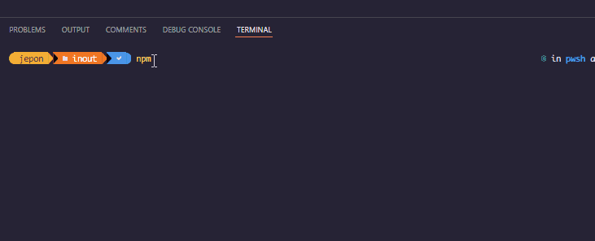

# Object Oriented TypeScript


Object Oriented programming (OOP) is a programming paradigm that relies on the concept of classes and objects. It is used to structure a software program into simple, reusable pieces of code blueprints (usually called classes), which are used to create individual instances of objects.


### OPP Keywords:

1. ### Abstraction

Objects only reveal internal mechanisms that are relevant for the use of other objects, hiding any unnecessary implementation code. This concept helps developers more easily make changes and additions over time.


Code:


```TypeScript
abstract class Polygon {
  public abstract getArea(): number;

  public toString(): string {
    return `Polygon[area=${this.getArea()}]`;
  }
}

class Rectangle extends Polygon {
  public constructor(protected readonly width: number, protected readonly height: number) {
    super();
  }

  public getArea(): number {
    return this.width * this.height;
  }
}

```


2. ### Inheritance


Inheritance is an aspect of OOPs languages, which provides the ability of a program to create a new class from an existing class. It is a mechanism which acquires the properties and behaviors of a class from another class. The class whose members are inherited is called the base class, and the class that inherits those members is called the **derived/child/subclass.** In child class, we can override or modify the behaviors of its parent class.


>### Confirm `Inheritance` 



