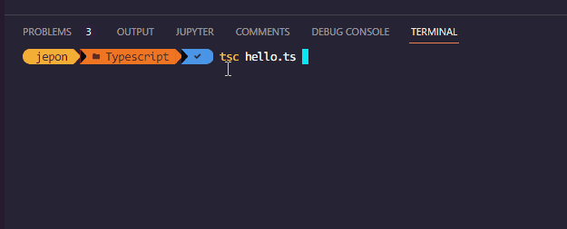

# Object Oriented TypeScript


Object Oriented programming (OOP) is a programming paradigm that relies on the concept of classes and objects. It is used to structure a software program into simple, reusable pieces of code blueprints (usually called classes), which are used to create individual instances of objects.


### OPP Keywords:

1. ### Abstraction

Objects only reveal internal mechanisms that are relevant for the use of other objects, hiding any unnecessary implementation code. This concept helps developers more easily make changes and additions over time.


Code:


```TypeScript

abstract class Person {
    name: string;
    
    constructor(name: string) {
        this.name = name;
    }

    display(): void{
        console.log(this.name);
    }

    abstract find(string): Person;
}

class Employee extends Person { 
    empCode: number;
    
    constructor(name: string, code: number) { 
        super(name); // must call super()
        this.empCode = code;
    }

    find(name:string): Person { 
        // execute AJAX request to find an employee from a db
        return new Employee(name, 1);
    }
}

let emp: Person = new Employee("Javier", 100);
emp.display(); //Javier

let emp2: Person = emp.find('Elvin');

```

>### Confirm `Abstract` 


2. ### Inheritance


Inheritance is an aspect of OOPs languages, which provides the ability of a program to create a new class from an existing class. It is a mechanism which acquires the properties and behaviors of a class from another class. The class whose members are inherited is called the base class, and the class that inherits those members is called the **derived/child/subclass.** In child class, we can override or modify the behaviors of its parent class.


Code:


```TypeScript
class Car {   
    Color:string     
    constructor(color:string) {   
       this.Color = color  
    }   
 }   
 class Toyota extends Car {   
     Price: number  
     constructor(color: string, price: number) {  
         super(color);  
         this.Price = price;  
     }  
     display():void {  
         console.log("Color of Toyota car: " + this.Color);  
         console.log("Price of Toyota car: " + this.Price);  
     }  
 }  
 let obj = new Toyota("Red", 45000 );  
 obj.display(); 


```


>### Confirm `Inheritance` 



